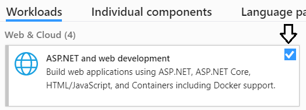
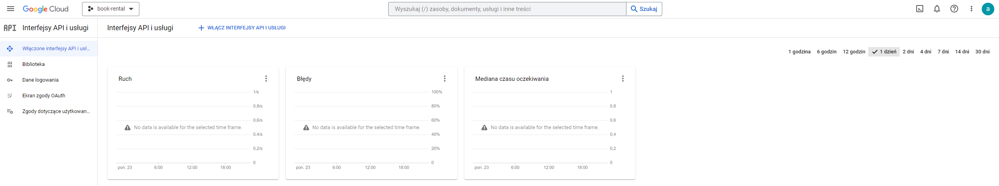
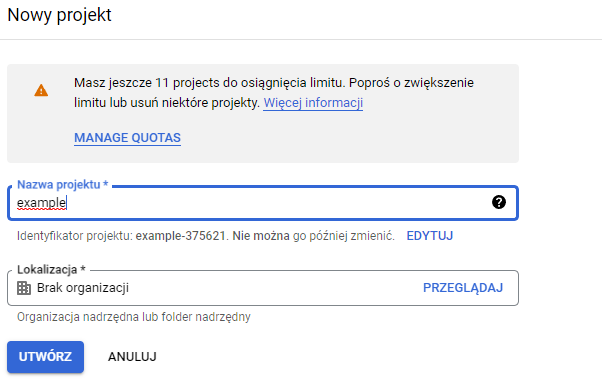
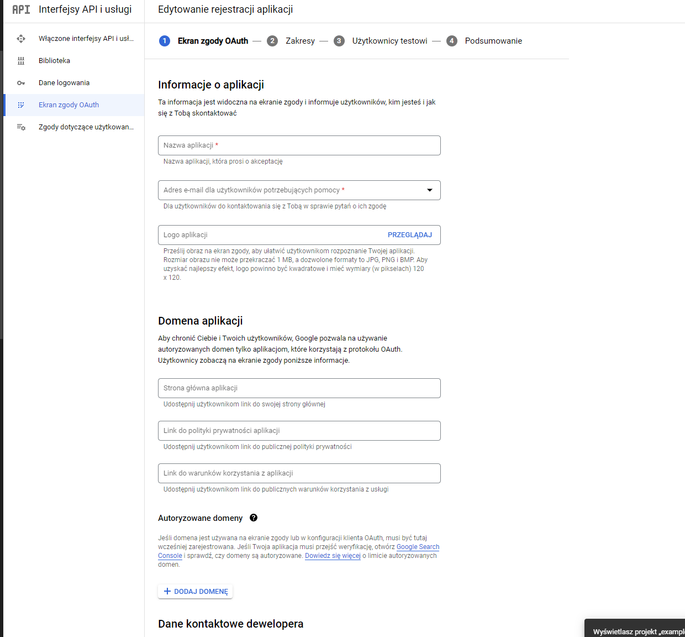
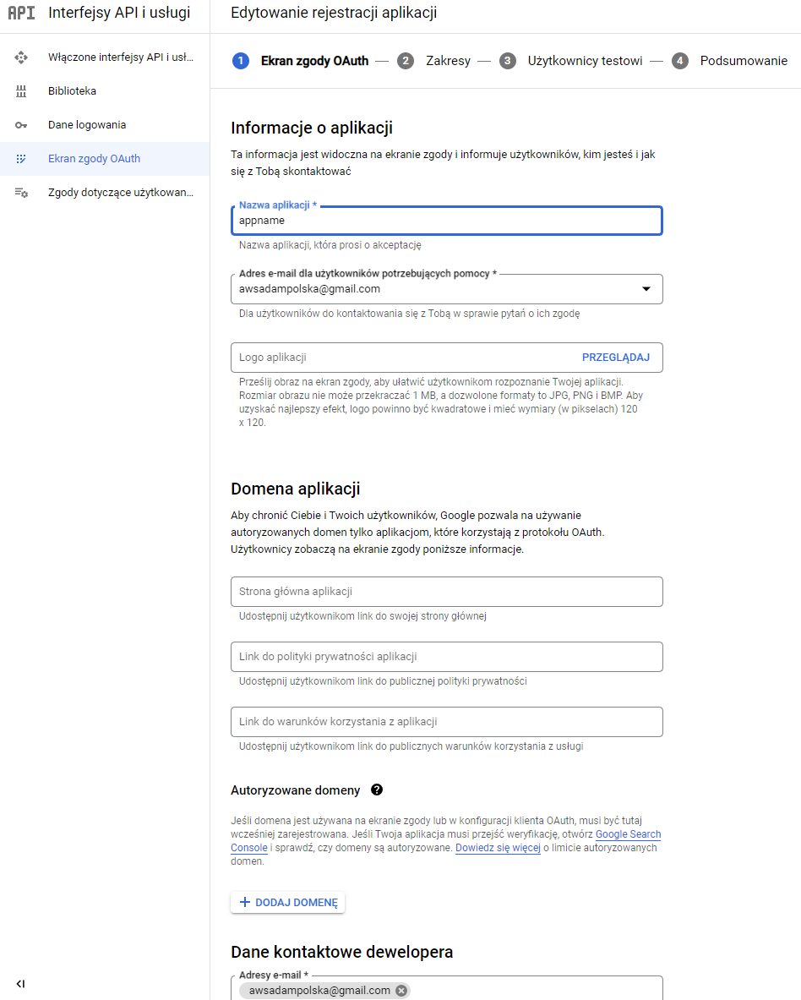
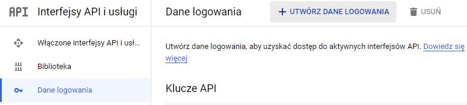
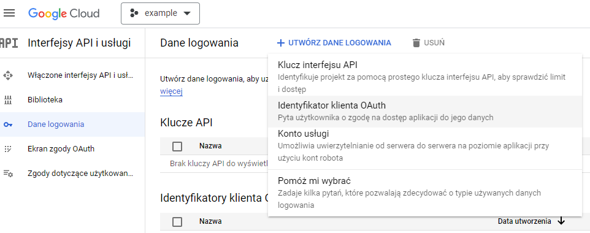
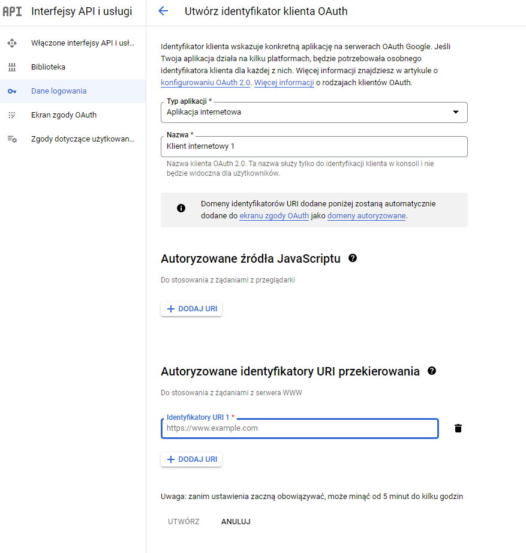
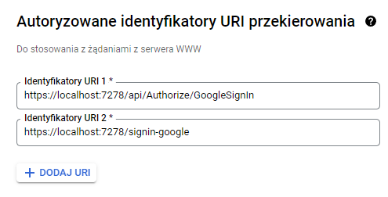
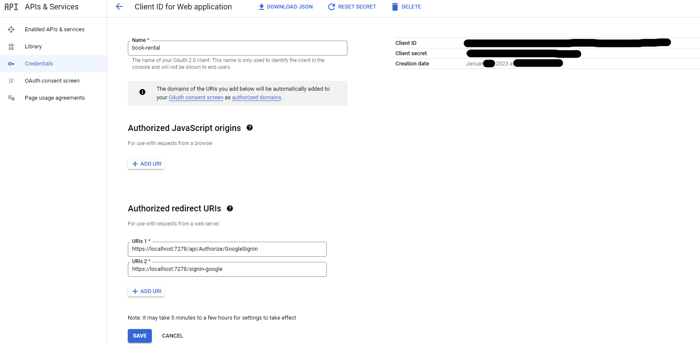

# Book Rental Blazor

A web application for books digital distribution.
Users can look trough service resources and rent books for limited time. Additionaly standard user can access content of \*owned books. From Admins perspective, you can Create, list modify and remove books and entities realted with them. As admin you can also manage users and code for books activation.

# Additional Info

It's created with .Net 7 version of Blazor Web Assembly(FE) and ASP.NET Web API(BE).

Project utilize two forms of authentication providers:

- Standard (login, password)
- Sign in with Google (additional configuration needed)

Both of them uses Microsoft Identity packages avaliable at nuget.org repository.

Applcation uses two Public APIs, [Google Identity Service](https://developers.google.com/identity/gsi/web/guides/overview) and [RandomDUK](https://www.google.com)

# Blazor and Blazor WASM

Code is run inside browser thanks to [WebAssembly](https://webassembly.org/) The Wasm stack machine is designed to be encoded in a size- and load-time-efficient binary format. <\*WebAssembly aims to execute at native speed by taking advantage of common hardware capabilities available on a wide range of platforms.>
Besides wasm project run web api that comunicates with wasm part.

# Installation

You need to install Visual Studio 2022
https://visualstudio.microsoft.com/vs/community/
with ASP.NET and web development workload.

After installation open BlazorStudiesProject.sln file
go to ServiceCollectionExtensions.cs file and fill missing credentials with yours(getting credentials will be expalained later) and start BlazorStudiesProject.Server(setup as defualt startup) by pressing F5.

# Google Login Configuration

If you don't have google account you need to create one.
Go to https://console.cloud.google.com/apis/dashboard

1. Create new project
2. Go to OAuth consent screen and follows steps
3. Go To Credentials tab click on create credentials (OAuth client ID) -> Application type = Web application
4. Add Authorized redirect URIs as bellow:
   https://localhost:7278/signin-google
   https://localhost:7278/api/Authorize/GoogleSignIn
   and save
5. Now you can get ClientID and Client secret needed in installation chapter. They are on right site of Credentials Tab
6. Having trubles? Check image-guide bellow

# Google Login Configuration image-help

# Documentation

The API documentation is available at: http://localhost:7278/Documentation
